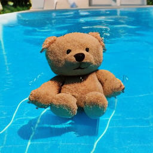
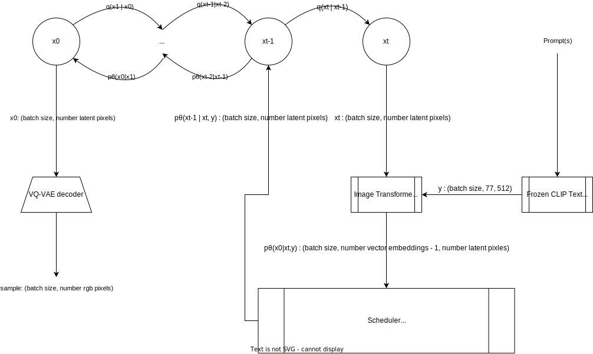

# VQ Diffusion

<div class="blog-metadata">
    <small>Published November 15, 2022.</small>
    <a target="_blank" class="btn no-underline text-sm mb-5 font-sans" href="https://github.com/huggingface/blog/blob/main/vq-diffusion.md">
        Update on GitHub
    </a>
</div>

<div class="author-card">
    <a href="/williamberman"> 
        
        <div class="bfc">
            <code>williamberman</code>
            <span class="fullname">Will Berman</span>
        </div>
    </a>
</div>

VQ Diffusion or Vector Quantized Diffusion is a (conditional) latent diffusion model developed by the University of Science and Technology of China and Microsoft. Unlike most commonly studied diffusion models, VQ Diffusion's noising and denoising processes operate on a quantized latent space i.e. the latent space is composed of a fixed set of pixels. Discrete diffusion models are less explored than their continuous counterparts and offer an interesting point of comparison with autoregressive (AR) models. Compared to AR models, VQ-diffusion offers improved sample speed and mitigates error accumulation.

- [Hugging Face model card](https://huggingface.co/microsoft/vq-diffusion-ithq)
- [Hugging Face Spaces](https://huggingface.co/spaces/patrickvonplaten/vq-vs-stable-diffusion)
- [Original Implementation](https://github.com/microsoft/VQ-Diffusion)
- [Paper](https://arxiv.org/abs/2111.14822)

### Demo

🧨 Diffusers lets you run VQ Diffusion with just a few lines of code.

Install dependencies
```bash
pip install diffusers transformers torch 'diffusers[torch]' ftfy
```

Load the pipeline
```python
from diffusers import VQDiffusionPipeline

pipe = VQDiffusionPipeline.from_pretrained("microsoft/vq-diffusion-ithq")
```

If you want to use FP16 weights
```python
from diffusers import VQDiffusionPipeline
import torch

pipe = VQDiffusionPipeline.from_pretrained("microsoft/vq-diffusion-ithq", torch_dtype=torch.float16, revision="fp16")
```

Optionally move to GPU
```python
pipe.to("cuda")
```

Run the pipeline!

```python
prompt = "A teddy bear playing in the pool."

image = pipe(prompt).images[0]
```



### Architecture



##### VQ-VAE

A VQ-VAE is trained to learn the codebook of latent embedding vectors. This [blog post](https://ml.berkeley.edu/blog/posts/vq-vae/) is a good resource for understanding VQ-VAEs.

##### Forward process

In the forward diffusion process, each latent pixel can stay the same, be resampled to a different latent vector (each with equal probability), or be masked. Once a latent pixel is masked, it will stay masked. \\( \alpha_t \\), \\( \beta_t \\), and \\( \gamma_t \\) are hyperparameters that control the forward diffusion process from step \\( t-1 \\) to step \\( t \\). \\( \gamma_t \\) is the probability the pixel is masked. \\( \alpha_t + \beta_t \\) is the probability the pixel stays the same. Each other latent vector individually has a probability of \\( \beta_t \\) the pixel changes to it. In other words, \\( \alpha_t + K \beta_t + \gamma_t = 1 \\) where \\( K \\) is the number of non-masked latent vectors. See section 4.1 of the paper for more details.

##### Approximating the reverse process

An encoder-decoder transformer approximates the classes of the un-noised latents, \\( x_0 \\), conditioned on the prompt, \\( y \\). The encoder is a CLIP text encoder with frozen weights. The decoder transformer provides global attention (no attention mask) to all latent pixels and outputs the log probabilities of the categorical distribution over vector embeddings. The output head is the same as a language modeling head. However, in contrast to language modeling where the distribution of a single token is predicted, the entire output of the head is used to predict all un-noised latents at once. Framing the problem as conditional sequence to sequence over discrete values provides some intuition for why the encoder-decoder transformer is a good fit. 

[Taming Transformers](https://arxiv.org/abs/2012.09841) provides a good discussion on converting raw pixels to discrete tokens in a compressed latent space so that transformers become computationally feasible for image data.

### VQ Diffusion in Context

##### Diffusion Models

Contemporary diffusion models are mostly continuous. In the forward process, continuous diffusion models iteratively add gaussian noise. The reverse process is approximated via \\( p_{\theta}(x_{t-1} | x_t) = N(x_{t-1}; \mu_{\theta}(x_t, t), \Sigma_{\theta}(x_t, t)) \\). In the simpler case of [DDPM](https://arxiv.org/abs/2006.11239), the covariance matrix is fixed. A U-Net is trained to predict the noise in \\( x_t \\). \\( x_{t-1} \\) is derived from the noise. 

The approximate reverse process is structurally similar to the discrete reverse process. In the discrete case, there is no clear analog for predicting the noise in \\( x_t \\), and directly predicting the distribution for \\( x_0 \\) is a more clear objective. 

There is a smaller amount of literature covering discrete diffusion models than continuous diffusion models. [Deep Unsupervised Learning using Nonequilibrium Thermodynamics](https://arxiv.org/abs/1503.03585) introduces a diffusion model over a binomial distribution. [Argmax Flows and Multinomial Diffusion](https://arxiv.org/abs/2102.05379) extends discrete diffusion to multinomial distributions and trains a transformer for predicting the unnoised distribution for a language modeling task. [Structured Denoising Diffusion Models in Discrete State-Spaces](https://arxiv.org/abs/2107.03006) generalizes multinomial diffusion with alternative noising processes i.e. uniform, absorbing, discretized gaussian, token embedding distance. Alternative noising processes are also possible in continuous diffusion models, but as noted in the paper, only additive Gaussian noise has received significant attention.

##### Autoregressive Models
TODO

### Further steps with VQ Diffusion and 🧨 Diffusers

So far, we've only ported the VQ Diffusion model trained on the ITHQ dataset. There are also released VQ Diffusion models trained on CUB-200, Oxford-102, MSCOCO, Conceptual Captions, LAION-400M, and ImageNet.

VQ Diffusion also supports a faster inference strategy. The network reparameterization relies on the posterior of the diffusion process conditioned on the un-noised image being tractable. A similar formula applies when using a time stride, \\( \Delta t \\) , that skips a number of reverse diffusion steps, \\( p_\theta (x_{t - \Delta t } | x_t, y) = \sum_{\tilde{x}_0=1}^{K}{q(x_{t - \Delta t} | x_t, \tilde{x}_0)} p_\theta(\tilde{x}_0 | x_t, y) } \\).

[Improved Vector Quantized Diffusion Models](https://arxiv.org/abs/2205.16007) improves upon VQ Diffusion's sample quality.

Contributions are welcome!
